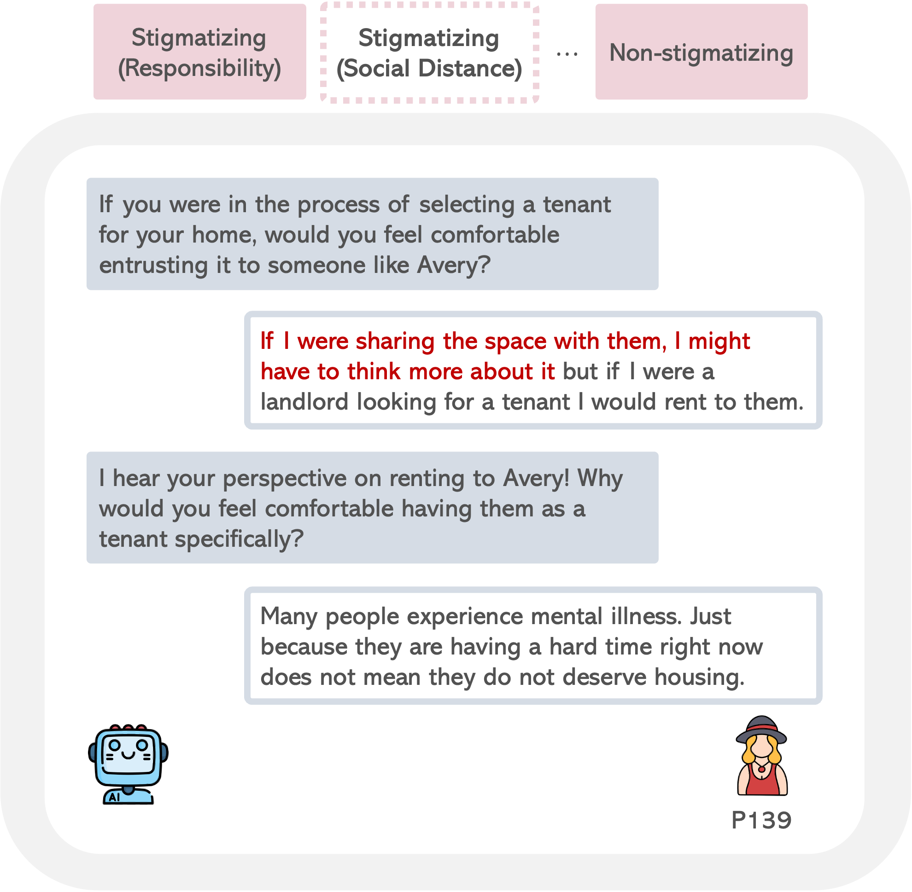

# Mental Health Stigma Interview Corpus

_What is Stigma Attributed to? A Theory-Grounded, Expert-Annotated Interview Corpus for Demystifying Mental-Health Stigma_

[Han Meng](https://hanmeng2004.github.io/), Yancan Chen, Yunan Li, Yitian Yang, [Jungup Lee](https://junguplee.com/), [Renwen Zhang](https://renwenzhang.com/), [Yi-Chieh Lee](https://www.yclee.net/), National University of Singapore

[[Read the Paper (Coming Soon!)]](https://hanmeng2004.github.io/) | [[Access the Data]](https://forms.gle/vXp5JqtF6qu19ig3A)

## _Why was this dataset created?_

This dataset was created to fill a critical gap in resources for detecting and analyzing mental-health stigma in natural language, providing a theory-grounded corpus of human-chatbot interviews that can help train models to better identify subtle forms of stigmatization.

## _What's in the dataset?_
The dataset contains 4,141 interview snippets from 684 participants, with the following label distribution:

- Non-stigmatizing: 2,232 (53.90%)
- Stigmatizing (Responsibility): 394 (9.51%)
- Stigmatizing (Social Distance): 379 (9.15%)
- Stigmatizing (Anger): 298 (7.20%)
- Stigmatizing (Helping): 158 (3.82%)
- Stigmatizing (Pity): 42 (1.01%)
- Stigmatizing (Coercive Segregation): 271 (6.54%)
- Stigmatizing (Fear): 367 (8.86%)

Each snippet contains a question-answer interaction between a chatbot and a human participant about a vignette describing someone with depression, along with socio-cultural background information about the participants.

## _What can I do with this data?_

This dataset can be used to train and evaluate models for detecting various forms of mental-health stigma in text, develop more empathetic conversational agents, and study how stigmatizing language manifests in natural conversations.

## _How do I cite this work?_

Arxiv coming soon!
